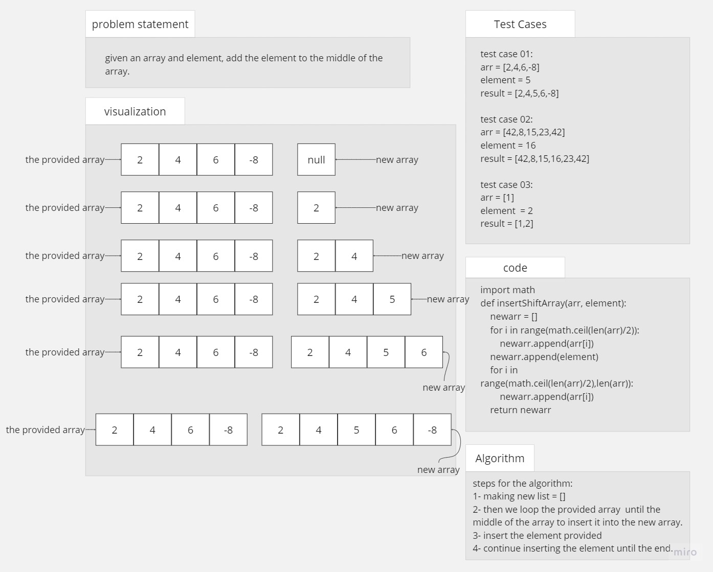
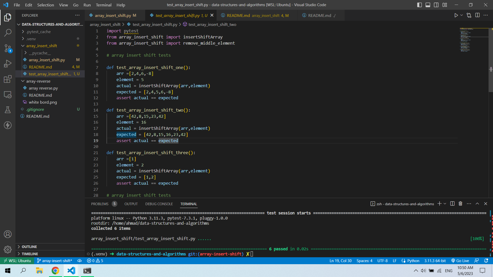

# array insert shift && remove middle element

## Whiteboard

## Solution

array insert shift code

if we say that arr =[2,4,6,-8] and element = 5 my code will 
1. first the code will copy the elements of the array from 0 to floor(n/2)
2. then adding the new element
3. lastly continue copying the elements of the array from ceil(n/2) to n

example of the code running

##### here is an image of my test file and the output of the tests