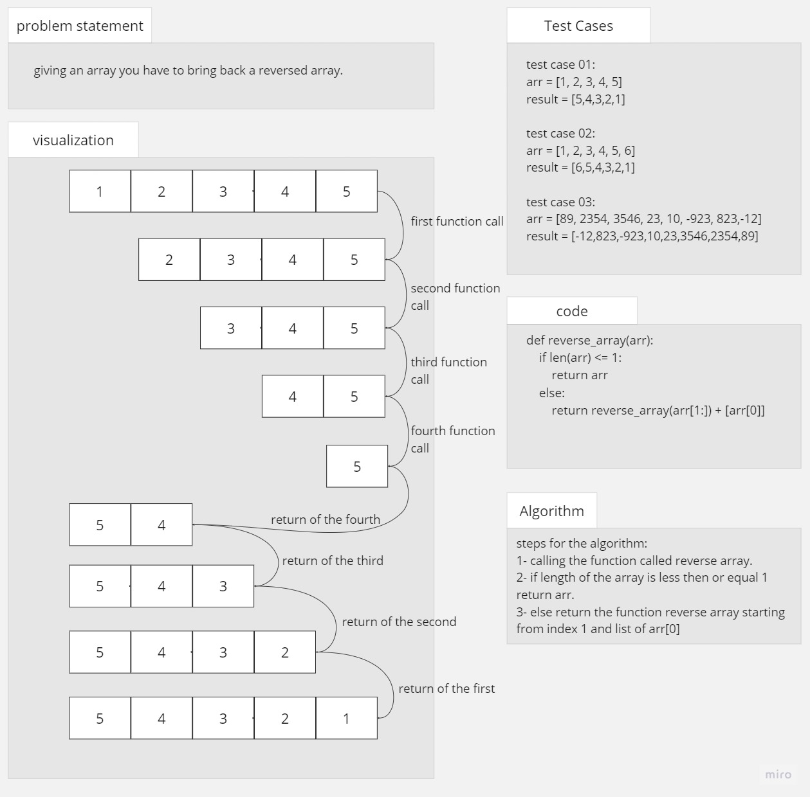

# array reverse

## whitebord

## Solution
array reverse  code

if we say that arr =[1,2,3,4,5] my code will 
1. first call the function array reverse in a recarseve way
2. untill the array length is 1 or less return array
3. then the parents function return the child funtion + arr[0]

example of the code running

.png)
##### here is an image of my test file and the output of the tests