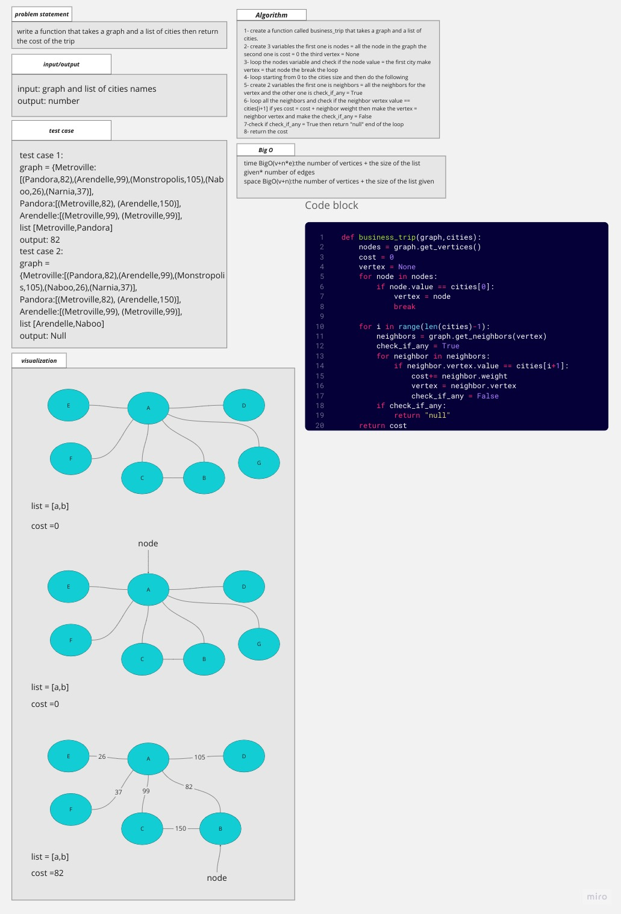
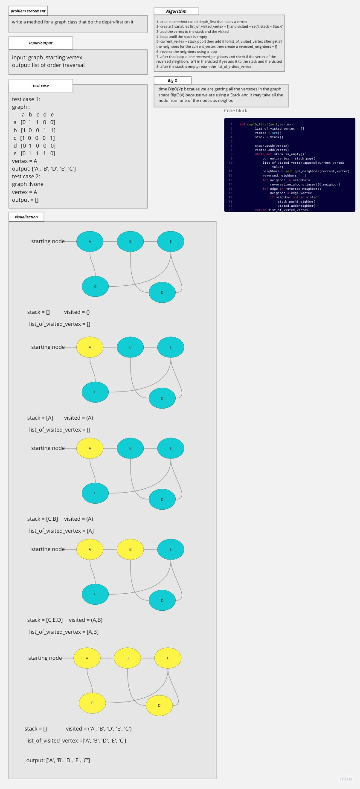
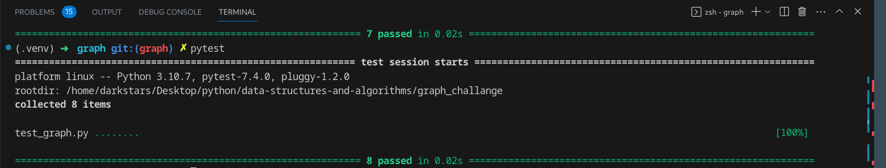

# Graph

## Whiteboard Process

not done

## Approach & Efficiency
the aproach is to make the base and test it before starting with adding and more

### big O

function add_vertex:
time: O(1)
space O(1)

function add_edge:
time: O(1)
space O(1)

function get_vertices:
time: O(n)
space O(1)

function get_neighbors:
time: O(n)
space O(1)

function size:
time: O(n)
space O(1)

function breadth_first:
time: O(n)
space O(n)

function business_trip:
time: O(v+n*e)
space O(v+n)
v = vertices
n = list size
e = edges

function depth_first:
time: O(V)
space O(V)

## Solution

### how to run the code

pytest then enter

or

python graph_challange/graph.py

