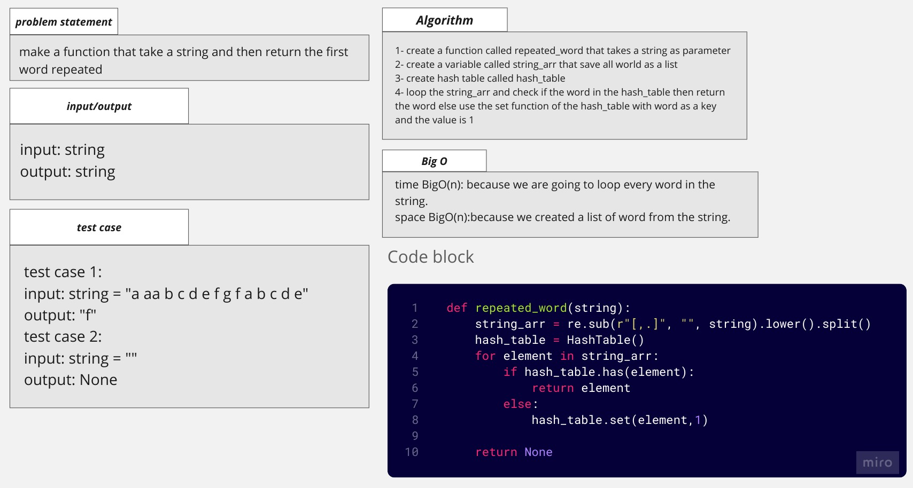

# hash table

## Whiteboard Process

## Approach & Efficiency
the aproach is to make the base (node and linked list) and test it before starting with adding and more

### big O

function set:
time: O(1)
space O(1)

function get:
time: O(1)
space O(1)

function has:
time: O(1)
space O(1)

function get_keys:
time: O(1)
space O(1)

function __hash_function:
time: O(1)
space O(1)

function repeated_word:
time: O(n)
space: O(n)

## Solution

### how to run the code

pytest then enter

or

python linked_list.py

