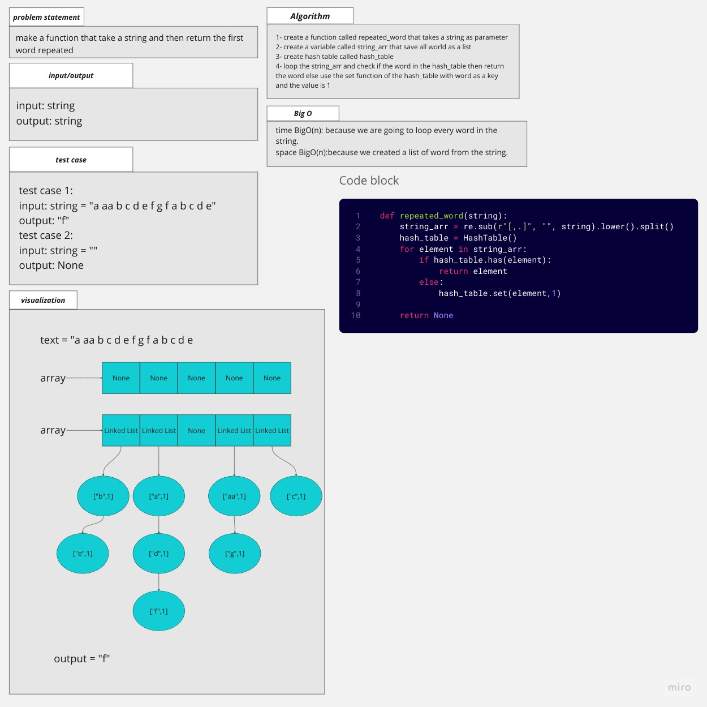

# hash table

## Whiteboard Process

## Approach & Efficiency
the aproach is to make the base and test it before starting with adding and more

### big O

function repeated_word:
time: O(n)
space O(n)

## Solution

### how to run the code

pytest then enter

or

python hash_table/hash_table.py

