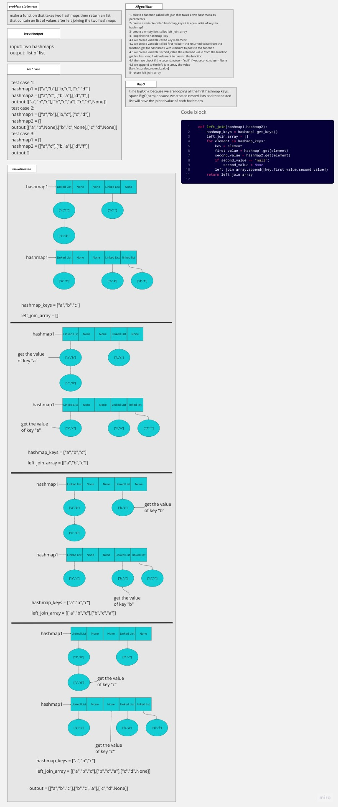
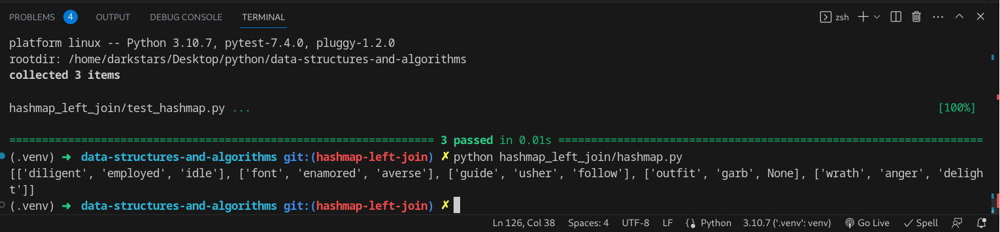

# hashmap left join

## Whiteboard Process

## Approach & Efficiency
the aproach is to make the base and test it before starting with adding and more

### big O

function left_join:

time: O(n)

space O(n+m)

## Solution

### how to run the code

pytest then enter

or

python hashmap_left_join/hashmap.py

