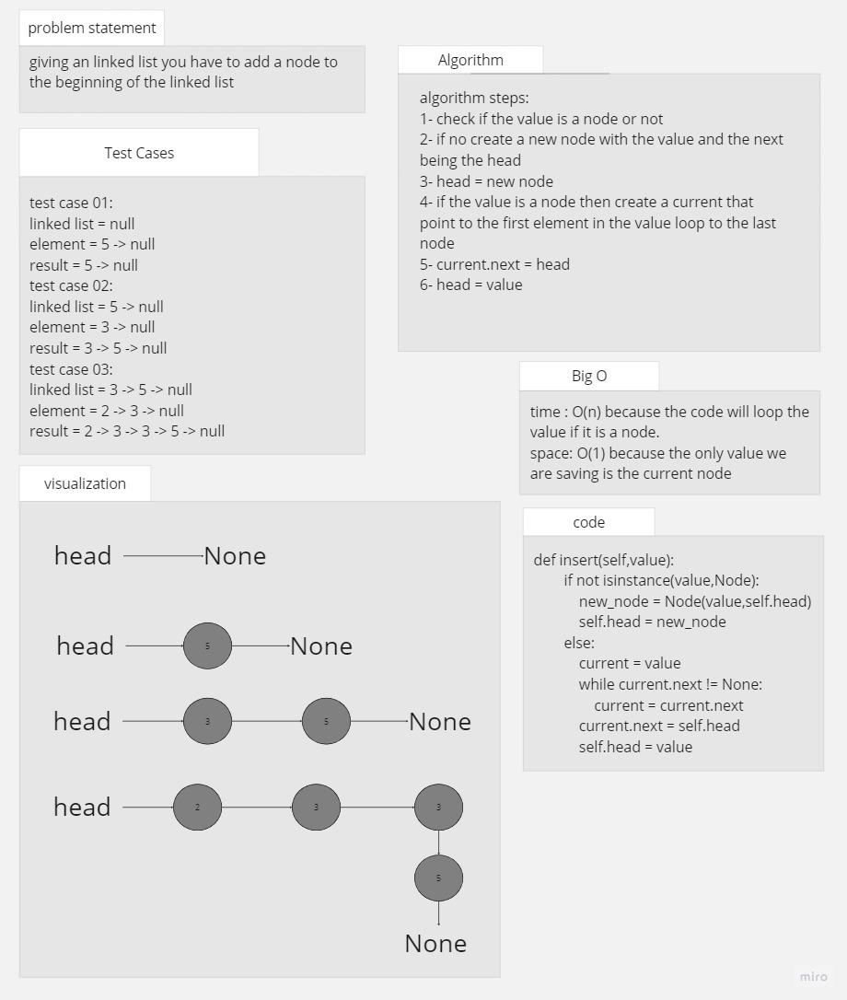
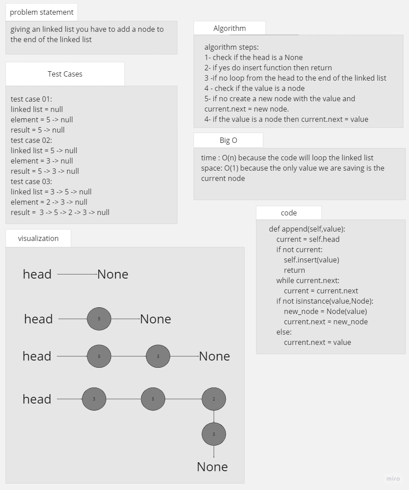
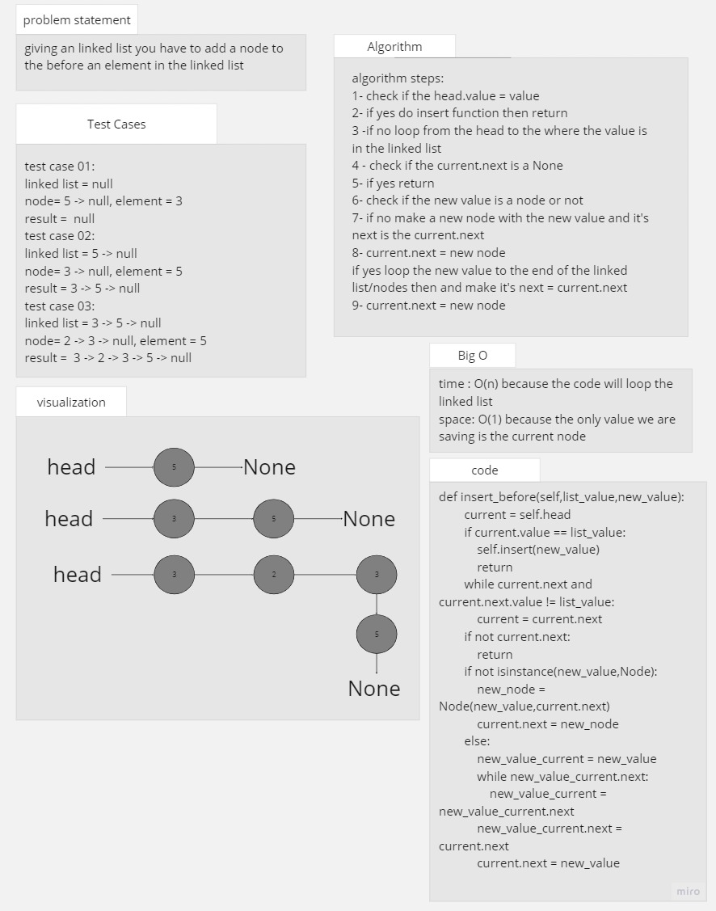
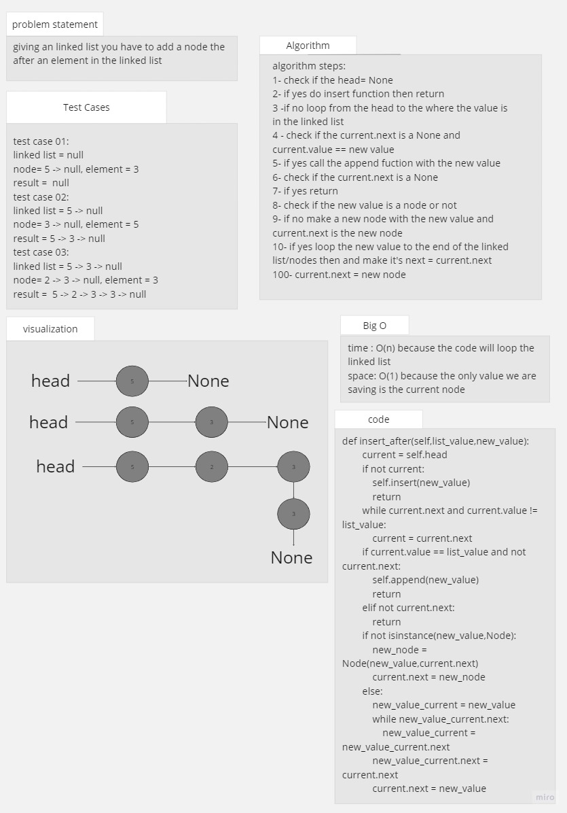
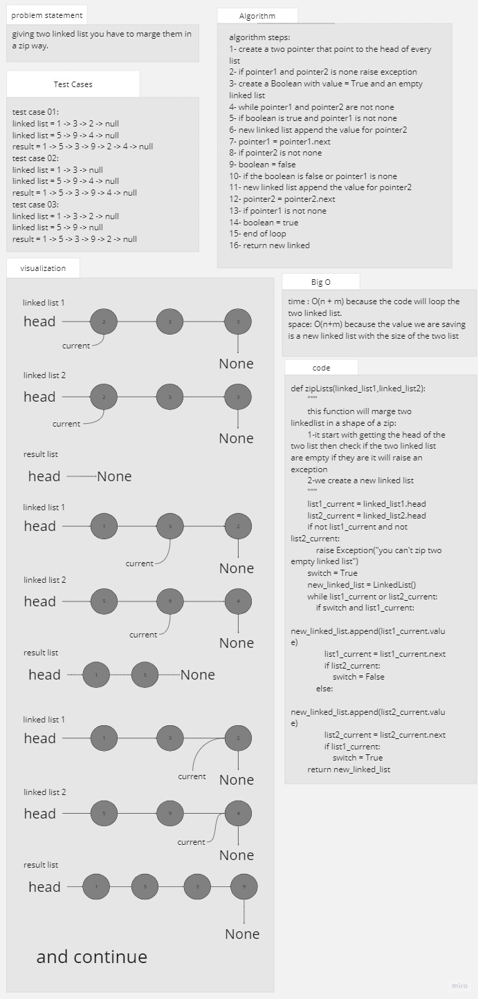

# linked list

## Whiteboard Process

## Approach & Efficiency
the aproach is to make the base (node and linked list) and test it before starting with adding and more

### big O

for zipLists:
the time O(n+m)
the space O(n+m)

## Solution

### how to run the code

pytest then enter

or

python linked_list.py

.png)