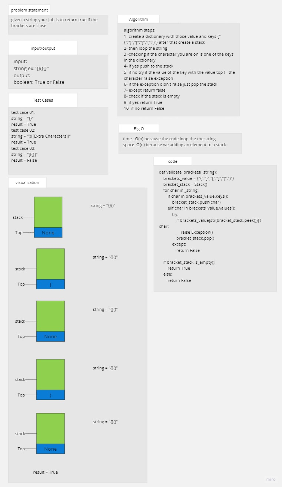

# stack queue brackets

## Whiteboard Process

## Approach & Efficiency
the aproach is to make the base of the program and test it before starting with adding and more

### big O

function validate_brackets:
time: O(n)
space O(n)

## Solution

### how to run the code

pytest stack_queue_brackets 

or

python stack_queue_brackets/brackets.py

.png)