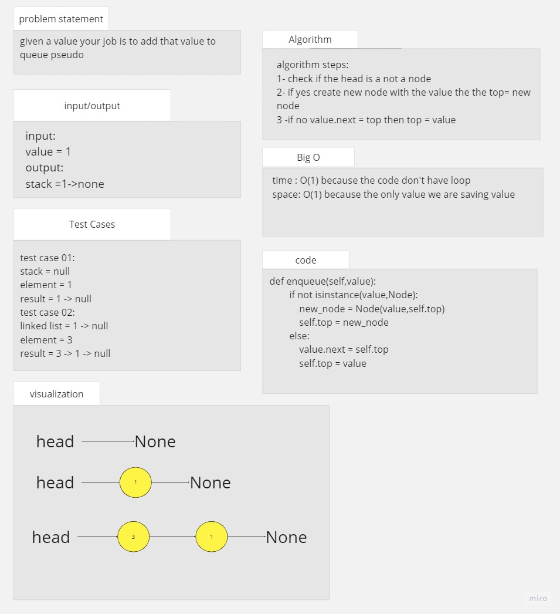
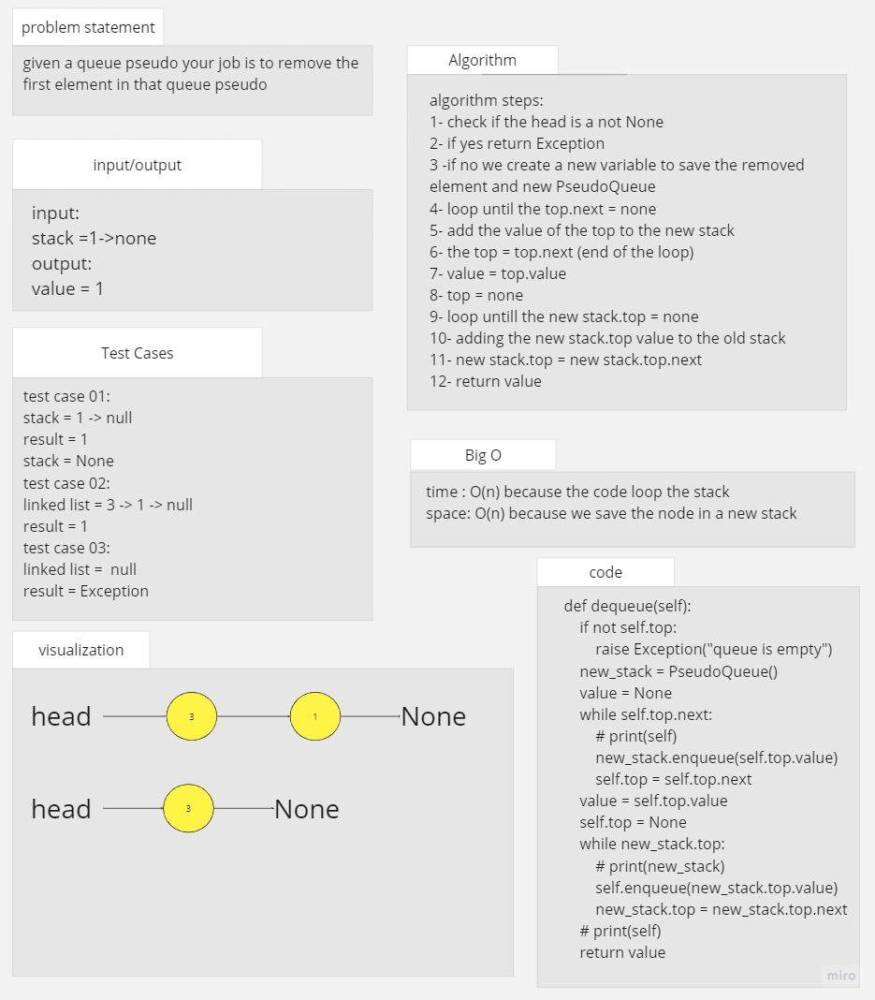
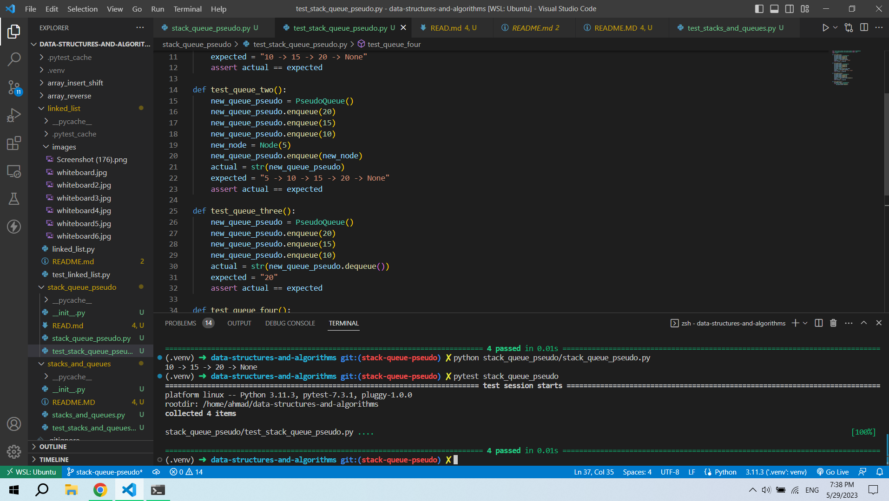

# queue pseudo

## Whiteboard Process

## Approach & Efficiency
the aproach is to make the base of the program and test it before starting with adding and more

### big O

function enqueue:
time: O(1)
space O(1)

function dequeue:
time: O(n)
space O(n)

## Solution

### how to run the code

pytest stack_queue_pseudo

or

python stack_queue_pseudo/stack_queue_pseudo.py

