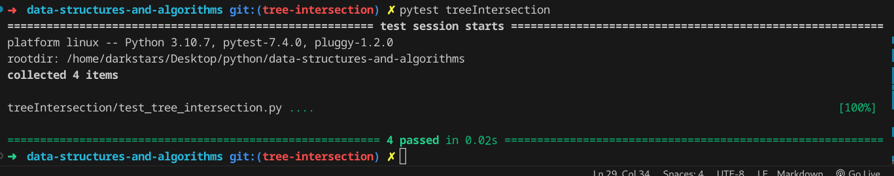

# hash table

## Whiteboard Process

## Approach & Efficiency
the aproach is to make the base and test it before starting with adding and more

### big O

function tree_intersection:

time: O(n*m)

space O(n)

## Solution

### how to run the code

pytest then enter

or

python treeIntersection/tree_intersection.py

