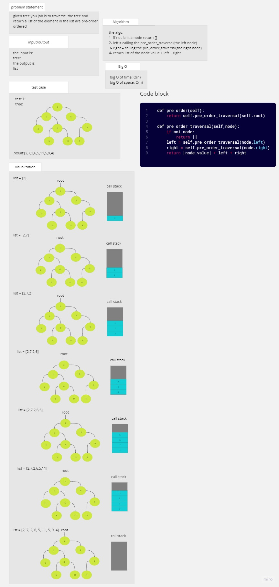
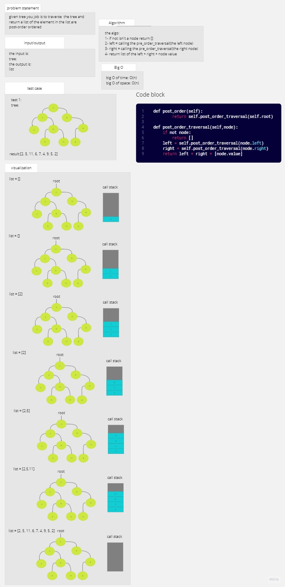
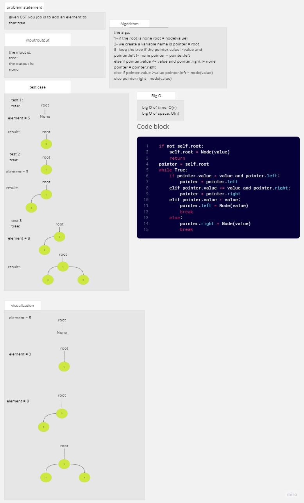
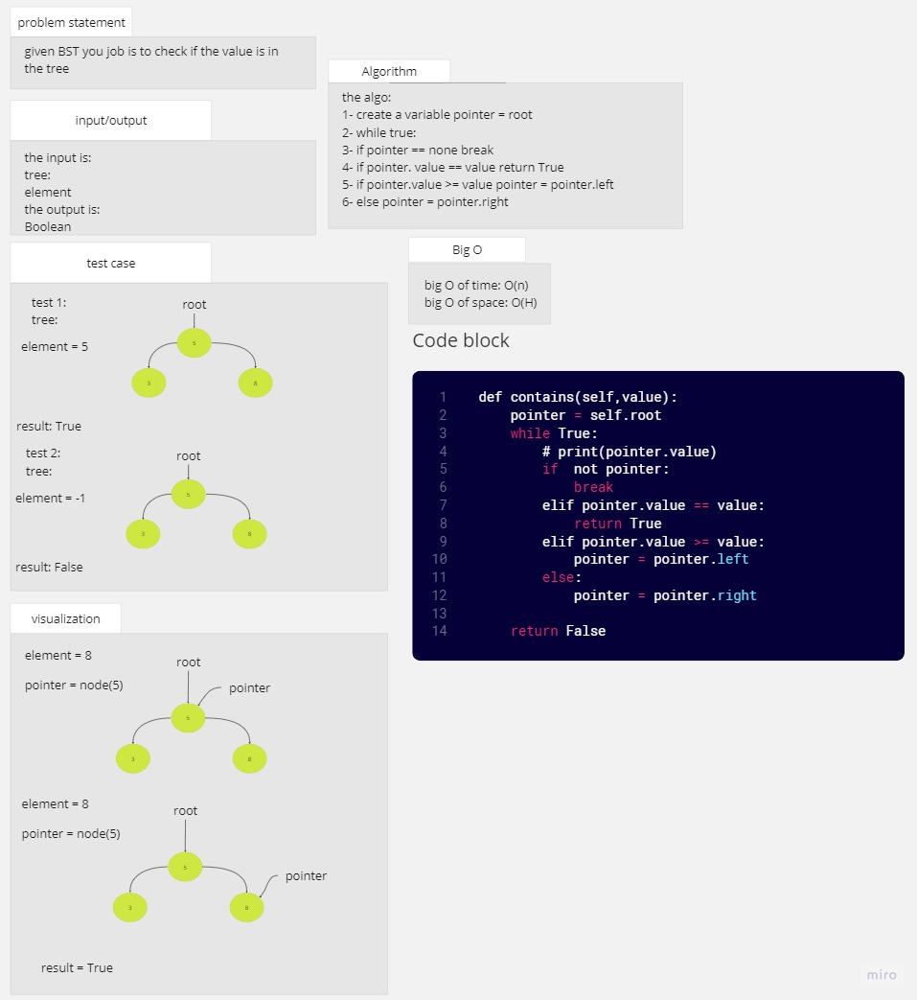
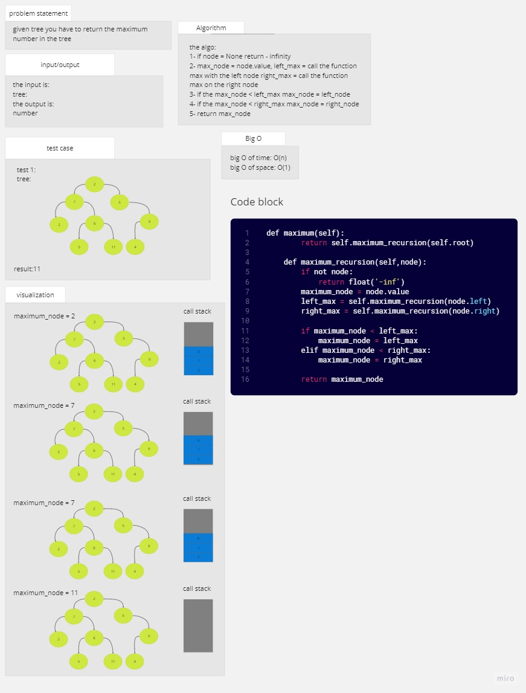

# trees

## Whiteboard Process

## Approach & Efficiency
the aproach is to make the base of the program and test it before starting with adding and more

### big O

function pre_order_traversal:
time: O(n)
space O(1)

function in_order_traversal:
time: O(n)
space O(1)

function post_order_traversal:
time: O(n)
space O(1)

function add:
time: O(log n)
space O(1)

function contains:
time: O(log n)
space O(1)

function maximum:
time: O(n)
space O(n)

## Solution

### how to run the code

python trees/tree.py

.png)